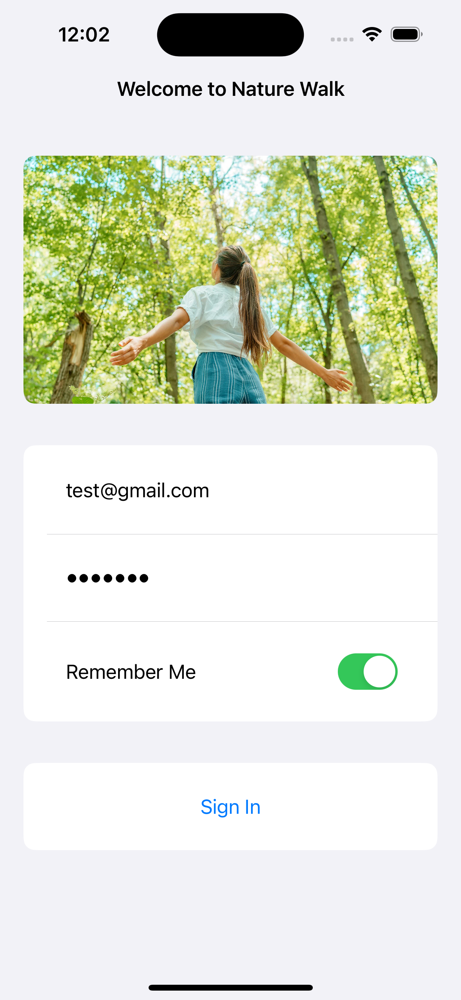
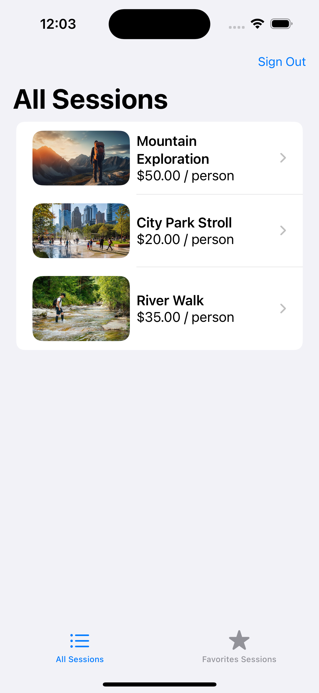
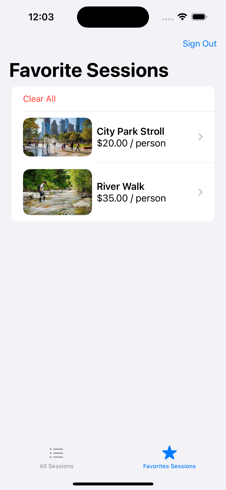
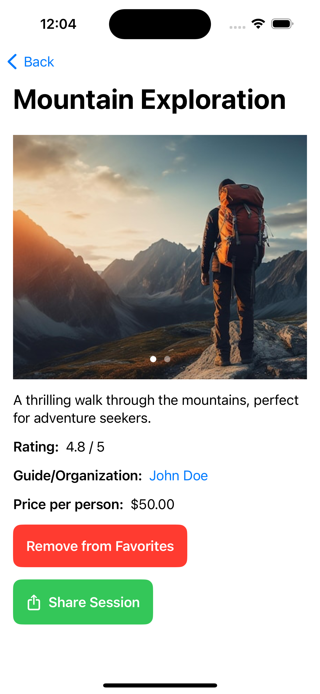
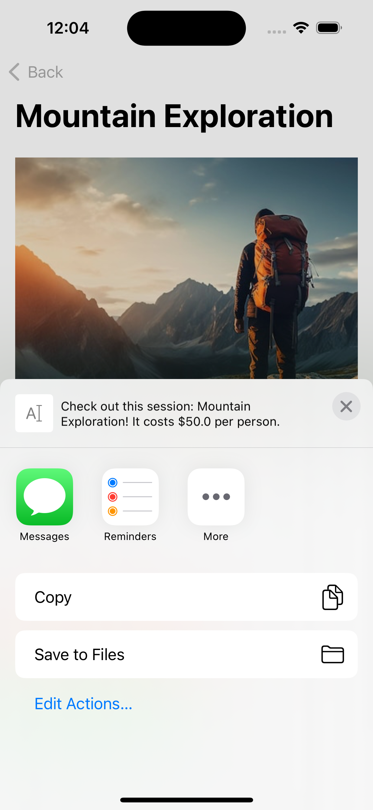
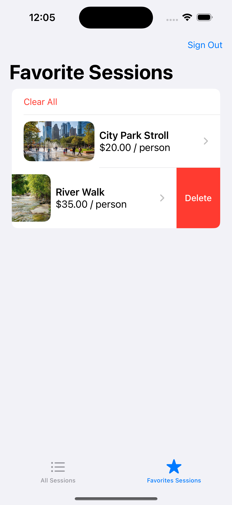
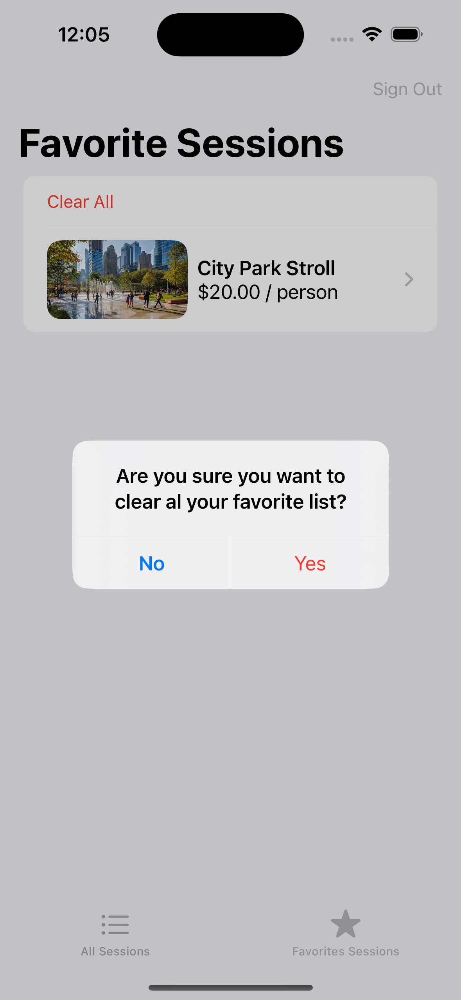
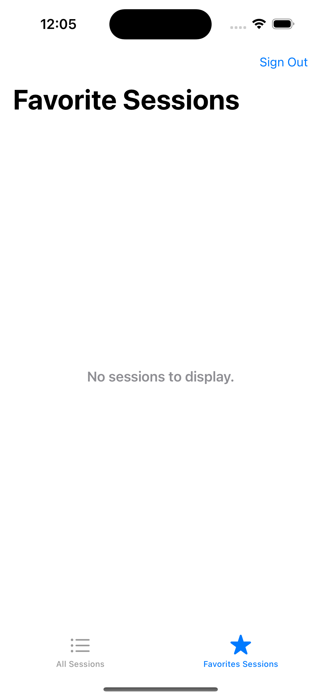

# Nature Walk App

<table>
  <tr>
    <td></td>
    <td></td>
    <td></td>
  </tr>
</table>

## Descripción

Esta aplicación iOS, desarrollada con Swift y SwiftUI, simula un sistema de gestión de sesiones de "Caminatas en la Naturaleza" donde los usuarios pueden ver, marcar como favoritas y compartir distintas sesiones. La app ofrece funcionalidades para iniciar sesión, ver todas las sesiones disponibles, gestionar una lista de sesiones favoritas y ver los detalles de cada sesión. Además, los usuarios pueden compartir sesiones a través de otras aplicaciones y eliminar sesiones favoritas, ya sea de manera individual o todas a la vez. Este proyecto muestra prácticas modernas de desarrollo iOS, como el uso de SwiftUI para construir interfaces de usuario responsivas, @EnvironmentObject y @ObservableObject para la gestión de estado, y UserDefaults para la persistencia de datos.

## Características

- **Swift**: Usado para desarrollar la lógica de la aplicación.
- **SwiftUI**: Para diseñar la interfaz de usuario.
- **UserDefaults**: Para persistir datos del usuario localmente.
- **ObservableObject**: Para gestionar el estado entre vistas.
- **EnvironmentObject**: Para compartir datos entre múltiples vistas.
- **NavigationLink**: Para navegar entre diferentes pantallas.
- **OOP**: Demuestra los principios de programación orientada a objetos.

## Configuración Necesaria

- No se requiere configuración adicional.

## Demostración

A continuación, algunas capturas de pantalla de la aplicación:

<table>
  <tr>
    <td></td>
    <td></td>
  </tr>
  <tr>
    <td></td>
    <td></td>
  </tr>
  <tr>
    <td></td>
    <td></td>
  </tr>
  <tr>
    <td></td>
    <td></td>
  </tr>
</table>

## License 

The MIT License (MIT)

- **Copyright (c) 2024 Jonathan Reátegui**

Permission is hereby granted, free of charge, to any person obtaining a copy of this software and associated documentation files (the "Software"), to deal in the Software without restriction, including without limitation the rights to use, copy, modify, merge, publish, distribute, sublicense, and/or sell copies of the Software, and to permit persons to whom the Software is furnished to do so, subject to the following conditions:

The above copyright notice and this permission notice shall be included in all copies or substantial portions of the Software.

THE SOFTWARE IS PROVIDED "AS IS", WITHOUT WARRANTY OF ANY KIND, EXPRESS OR IMPLIED, INCLUDING BUT NOT LIMITED TO THE WARRANTIES OF MERCHANTABILITY, FITNESS FOR A PARTICULAR PURPOSE AND NONINFRINGEMENT. IN NO EVENT SHALL THE AUTHORS OR COPYRIGHT HOLDERS BE LIABLE FOR ANY CLAIM, DAMAGES OR OTHER LIABILITY, WHETHER IN AN ACTION OF CONTRACT, TORT OR OTHERWISE, ARISING FROM, OUT OF OR IN CONNECTION WITH THE SOFTWARE OR THE USE OR OTHER DEALINGS IN THE SOFTWARE.

## Notes

- This README is also available in Spanish  [here](README-es.md)
- Este README también está disponible en español  [aquí](README-es.md)
